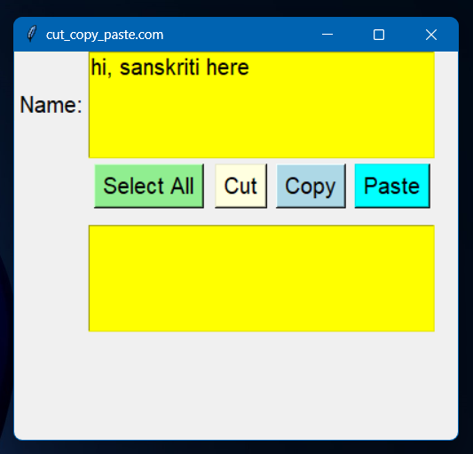
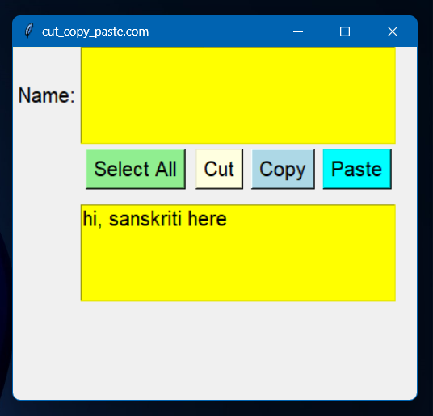
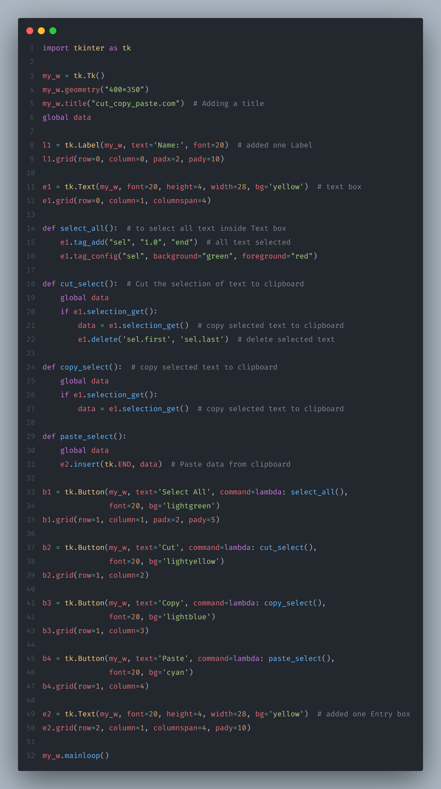

 

## ClipBoard

BugsMirror Task 1

* As a part of campus placement, recently an Indore based start-up BugsMirror initiated the hiring process.
* In the first round there were two tasks (mini projects) given out of which we had to do one of our choice (description is added).
* I chose task which was to create clipboard using Python and it's libraries. I chose tkinter library to create a separate window as ouyput.
* In that task I created a clipboard in which we can type and then we can perform actions on the selected text like "Select All", 'Cut", "Copy" and "Paste".

## Output of the project

<table>
  <tr>
    <td>Type name</td>
    <td>Select All</td>
    <td>Copy Paste</td>
  </tr>
  <tr>
    <td></td>
    <td></td>
    <td></td>
  </tr>
 </table>

<table align="center">
  <tr>
    <td>Select Cut</td>
    <td>Cut Paste</td>
  </tr>
  <tr>
    <td></td>
    <td></td>
  </tr>
 </table>

## Problem & Code

<table>
  <tr>
    <td>Problem Statement</td>
    <td>Code Snippet</td>
  </tr>
  <tr>
    <td></td>
    <td></td>
  </tr>
 </table>
